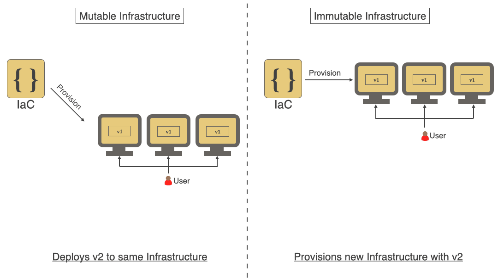
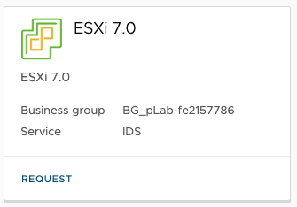
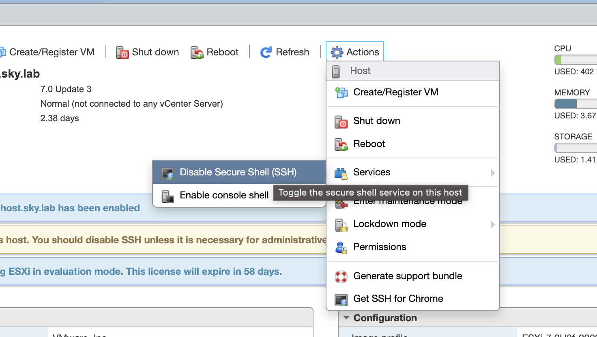
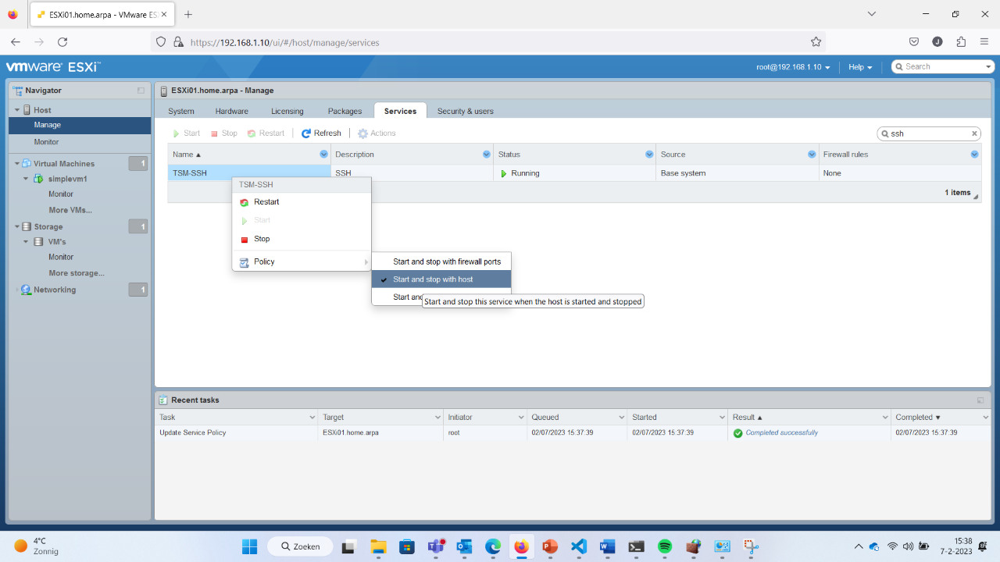

# Les 1 - Hello, IAC!

Inhoud:

- Introductie vak IAC
- Introductie Infrastructure as Code
- Waarom IAC? Waarom _geen_ IAC?
- Key Principes
- Ontwikkelomgeving
- Een eerste deployment
- Opdracht tijd

## Introductie vak IAC

- 7 weken
- 3 uur per keer op je rooster
- Elke week een thema
- Ruimte om aan opdrachten te werken
- Alle losse opdrachten bij elkaar vormt voor je eindopdracht
- Aan het einde maak je een portfolio video waarin je laat zien dat alle opdrachten werken
- Alle code moet in Gitlab (gitlab.windesheim.nl)
- Bij elke week schrijf je een README.md wat je gedaan hebt en hoe de code werkt.

## Introductie Infrastructure as Code

Veel ontwikkelaars en systeembeheerders beheren servers door via SSH in te loggen, wijzigingen door te voeren en daarna weer uit te loggen. Soms wordt bijgehouden wat er is aangepast, maar vaak ook niet. Als een beheerder dezelfde wijziging op meerdere servers moet uitvoeren (bijvoorbeeld een configuratie aanpassen), logt hij op elke server apart in en herhaalt de aanpassing steeds opnieuw.

Dit werkt prima als er maar één of twee wijzigingen nodig zijn gedurende de levensduur van een server, de server heel eenvoudig is (bijvoorbeeld één proces met een simpele configuratie) en elke wijziging goed wordt vastgelegd. Maar in de meeste bedrijven zijn servers veel complexer. Ze draaien vaak tientallen tot honderden applicaties of containers, hebben ingewikkelde firewalls en veel aangepaste configuratiebestanden. Zelfs met goede documentatie worden bij handmatige aanpassingen vaak servers of stappen overgeslagen.

Als een bedrijf een nieuwe server wil instellen die precies werkt zoals een bestaande server, kost dat veel tijd. Beheerders moeten alle geïnstalleerde software, instellingen, versies en configuraties nakijken en documenteren. Daarna moeten ze alles handmatig opnieuw installeren, updaten en instellen, wat veel onnodige tijd kost.

Soms maken beheerders een shell-script om dit proces makkelijker te maken, maar die scripts worden vaak te ingewikkeld, alleen begrepen door de maker en niet bruikbaar op andere systemen door verschillen in hardware of software.

##### Shell commando's

Bijvoorbeeld, een beheerder wil een nginx webserver en de passenger applicatieserver installeren. Dit kan hij doen met de volgende commando's:

**Uitwerking:**

```bash
root@server:~# vi /etc/apt/sources.list.d/passenger.list
root@server:~# chown root: /etc/apt/sources.list.d/passenger.list
root@server:~# chmod 600 /etc/apt/sources.list.d/passenger.list

root@server:~# apt-get update

root@server:~# apt-get install nginx-full passenger
root@server:~# vi /etc/nginx/nginx.conf

root@server:~# service nginx restart
```

Je ziet dat de beheerder een aantal configuratiebestanden en rechten moet aanpassen, de packages installeert en de service herstart. Maar je hebt geen idee wat hij nou heeft aangepast, dus het is niet heel herhaalbaar voor iemand anders zonder documentatie.
Een oplossing kan dan een shell script zijn. In een shell script kun je alle commando's die je op de CLI intikt achter elkaar zetten en er wat logica (if/then/for etc) aan toevoegen. Maar shell script kunnen (onnodig) complex worden door deze logica. Kijk maar eens naar het voorbeeld hieronder. Het zijn dezelfde commando's als net op de CLI, maar dan met allerlei condities toegevoegd.

```bash
#!/bin/bash

# Configuratie
LOGFILE="/var/log/install_nginx_passenger.log"
NGINX_CONF="/etc/nginx/nginx.conf"
PASSENGER_REPO_FILE="/etc/apt/sources.list.d/passenger.list"

# Functie voor logging
log_message() {
    local LOG_LEVEL=$1
    local MESSAGE=$2
    echo -e "[$(date '+%Y-%m-%d %H:%M:%S')] [$LOG_LEVEL] $MESSAGE" | tee -a "$LOGFILE"
}

# Controleren op root-rechten
if [[ $EUID -ne 0 ]]; then
    log_message "ERROR" "Dit script moet als root worden uitgevoerd."
    exit 1
fi

# Installeren van apt-transport-https
log_message "INFO" "Controleren of apt-transport-https al is geïnstalleerd..."
if ! dpkg -l | grep -q apt-transport-https; then
    log_message "INFO" "apt-transport-https wordt geïnstalleerd..."
    apt-get install -y apt-transport-https >> "$LOGFILE" 2>&1 || { log_message "ERROR" "Installatie van apt-transport-https mislukt!"; exit 1; }
else
    log_message "INFO" "apt-transport-https is al geïnstalleerd."
fi

# Toevoegen van Passenger repository
log_message "INFO" "Controleren of Passenger repository al bestaat..."
if [[ ! -f "$PASSENGER_REPO_FILE" ]]; then
    log_message "INFO" "Passenger repository toevoegen..."
    cat <<EOF > "$PASSENGER_REPO_FILE"
deb https://oss-binaries.phusionpassenger.com/apt/passenger focal main
EOF
    chown root: "$PASSENGER_REPO_FILE"
    chmod 600 "$PASSENGER_REPO_FILE"
else
    log_message "INFO" "Passenger repository bestand bestaat al."
fi

# Apt-cache bijwerken
log_message "INFO" "Apt-cache bijwerken..."
apt-get update >> "$LOGFILE" 2>&1 || { log_message "ERROR" "Apt-cache update mislukt!"; exit 1; }

# Installeren van nginx en passenger
log_message "INFO" "Controleren of nginx en passenger al zijn geïnstalleerd..."
if ! dpkg -l | grep -q nginx; then
    log_message "INFO" "nginx wordt geïnstalleerd..."
    apt-get install -y nginx-full passenger >> "$LOGFILE" 2>&1 || { log_message "ERROR" "Installatie van nginx of passenger mislukt!"; exit 1; }
else
    log_message "INFO" "nginx is al geïnstalleerd."
fi

# Configureren van nginx
log_message "INFO" "Controleren of Passenger is geconfigureerd in nginx..."
if ! grep -q "passenger_root" "$NGINX_CONF"; then
    log_message "INFO" "Passenger configuratie toevoegen aan nginx..."
    sed -i '/http {/a \    passenger_root /usr/lib/ruby/vendor_ruby/phusion_passenger/locations.ini;\n    passenger_ruby /usr/bin/ruby;' "$NGINX_CONF" || { log_message "ERROR" "Fout bij aanpassen van $NGINX_CONF!"; exit 1; }
else
    log_message "INFO" "Passenger is al geconfigureerd in nginx."
fi

# Controleren op syntaxfouten in nginx-config
log_message "INFO" "Controleren van nginx-config op fouten..."
nginx -t >> "$LOGFILE" 2>&1 || { log_message "ERROR" "Nginx-config bevat fouten! Controleer handmatig."; exit 1; }

# Starten van nginx
log_message "INFO" "Nginx opnieuw starten..."
if systemctl restart nginx >> "$LOGFILE" 2>&1; then
    log_message "INFO" "Nginx is succesvol herstart."
else
    log_message "ERROR" "Nginx herstarten mislukt! Controleer de logbestanden."
    exit 1
fi

# Controleren of nginx draait
log_message "INFO" "Controleren of nginx draait..."
if systemctl is-active --quiet nginx; then
    log_message "INFO" "Nginx draait correct."
else
    log_message "ERROR" "Nginx draait niet! Controleer de configuratie en services."
    exit 1
fi

# Afronden
log_message "INFO" "Installatie en configuratie voltooid! Zie $LOGFILE voor details."
```

Zie je hoe groot dit shell script is geworden? Tuurlijk kan het kleiner, maar deze beheerder is helemaal los gegaan op z'n shell-script skills.
Maar gaat deze beheerder ook dit shell script of de handmatige configuratie stappen toepassen op servers die maar een dag, een uur of soms zelfs maar 1 enkele taak in een container in secondes afhandelen? Of wat gebeurd er als het script halverwege met een foutmelding stopt? De exit 1 zorgt ervoor dat het script er dan uitklapt. En belangrijker: het script kan waarschijnlijk niet opnieuw gestart worden, commando's zullen dan fout gaan en het script zal opnieuw eruit klappen. Dus, we hebben iets anders nodig. Iets wat snel infrastructuur voor ons kan aanmaken en dit ook snel en herhaaldelijk kan aanpassen en we er zeker van zijn dat de uitkomst altijd hetzelfde is.

## Key Principes

### Idempotency & Desired State

Zoals net aangegeven willen we dat iedere wijziging die we doen dezelfde uitkomst heeft. Ook al voeren we een stuk code dus meerdere malen achter elkaar uit (op hetzelfde systeem of een ander), de uitkomst is telkens hetzelfde. In ons geval dus de Infrastructuur die we aan willen maken. Dit principe staat ook wel bekend als **Idempotency.**


Nog weer even terug naar het shell script, je ziet daar allerlei condities om te checken of iets al bestaat etc. Dit is een vorm van idempotency maar het kan veel makkelijker. Waarom zou je al die checks niet door een tool zelf uit laten voeren?
Echt idempotency wordt pas bereikt als je scripts of configuraties herhaaldelijk kan uitvoeren zonder dat er dan iets onverwachts of schadelijks voor het systeem gebeurd.

### Declarative

Idempotency kun je bereiken door een tool te gebruiken die werkt met een declaratieve aanpak. In plaats van stap voor stap te vertellen hoe je iets moet doen (zoals bij een script), beschrijf je in een declaratieve taal alleen de gewenste eindsituatie (desired state). De tool zorgt er vervolgens zelf voor dat de infrastructuur in die staat komt. Als dit niet lukt, geeft de tool een foutmelding en worden de wijzigingen niet doorgevoerd. Je hoeft je als beheerder dus niet bezig te houden met hoe iets wordt gedaan; dat regelt de tool.

Dit vraagt om een andere manier van denken, vooral voor mensen die gewend zijn te werken met losse commando’s of imperatieve shell-scripts zoals in bovenstaand voorbeeld.
Wat als we de commando's uit oefening 1 en 2 op een declaratieve manier willen opschrijven? Stel we gebruiken Ansible als tool:

```yaml
---
- hosts: all
  tasks:

  - name: Ensure the passenger apt repository is added
    apt_repository:
      state=present
      repo='deb https://oss-binaries.phusionpassenger.com/apt/passenger raring main'

  - name: Ensure https support for apt is installed
    apt:
      name: {{ item }}
      state=present
      with_items:
        - apt-transport-https
        - nginx-full
        - passenger

  - name: Ensure the nginx configuration file is set
    copy:
      src=/app/config/nginx.conf
      dest=/etc/nginx/nginx.conf

  - name: Ensure nginx is running
    service:
      name=nginx
      state=started
      enabled=true
```

Zie je dat het haast een leesbaar draaiboek is geworden? We programmeren geen commando's meer, maar geven in een draaiboekstijl aan wat er moet gebeuren.

### Immutability

Wanneer er gedurende een bepaalde periode allerlei wijzigingen in de infrastructuur worden aangebracht worden deze vaak niet over alle systemen tegelijk toegepast. Er onstaat dan Configuration Drift. Omgevingen gaan van elkaar afwijken op manieren die niet gemakkelijk reproduceerbaar zijn (denk maar aan handmatige commando's, versie/hardware verschillen). Configuration Drift zorgt voor een lastig beheersbare infrastructuur.

Een oplossing voor Configuration Drift is **immutable infrastructure**. Immutable betekent in dit geval dat in plaats van een bestaande infrastructuur te wijzigen deze vervangen zal worden door een nieuwe. Dit is natuurlijk vooral van toepassing op gevirtualiseerde machines of cloudinstanties.

Immutable infrastructuur maakt ook schaalbaarheid mogelijk in (cloud)omgevingen. Het is makkelijk een tweede machine of container aan te maken omdat er geen handmatige wijzigen op de andere zijn doorgevoerd. Je kunt in diagram #2 hieronder zien dat voor veranderlijke (non-immutable) infrastructuur v2 van de applicatie wordt ingezet op dezelfde servers als v1, maar bij immutable infrastructuur worden er nieuwe VM's met v2 van applicatie aangemaakt.



### Versiebeheer

Als we alle methodes (declarative infrastructure, Immutability en Idempotency) combineren merk je dat je eigenlijk meer bezig bent met code schrijven dan het handmatig beheren van servers. We kunnen het ontwikkelen van infrastructuur dus vergelijken met 'normale' softwareontwikkeling waarbij versiebeheer de normaalste zaak van de wereld is. Versie 2.0 van een applicatie heeft bijvoorbeeld meer functies dan 1.0. Ditzelfde idee kun je nu gaan toepassen op infrastructure. Het moet bijvoorbeeld ook mogelijk zijn om (snel) terug te kunnen naar versie 1.0 mocht 2.0 ondanks alle testen niet goed werken.

Onze infrastructuurcode moeten we dus op gaan slaan in een versiebeheersysteem. In dit vak gebruiken we de GitLab omgeving van Windesheim. (https://gitlab.windesheim.nl). Zorg dat je hier een account hebt waar je een repository kunt aanmaken.

Zie ook onderstaande YouTube video van HashiCorp:

[](https://youtu.be/OPDJXicUBuo)

### LAB

##### Ontwikkelomgeving (opdracht 1)

- VPN naar Skylab pfsense is vereist.
- Ontwikkel en commando omgeving (Ubuntu VM) in Skylab
- VSCode of andere editor op lokale machine
- We werken niet met de remote console van Skylab maar alleen via een Terminal. Dit is een knock out voor je beoordeling!

##### ESXi (opdracht 2)

Om de opdrachten uit te kunnen voeren heb je ook een ESXi omgeving nodig op Skylab. Deploy deze met default instellingen, 16GB ram + 50gb extra storage disk toekennen



Log daarna in op de ESXi console met username **root** en wachtwoord **Welkom01!**
Daarna moet SSH toegang aan worden gezet via **Actions>Services>SSH**



Via **Manage->Services** kun je SSH altijd laten opstarten, zodat je dit niet elke keer hoeft te doen.



Maak als laatste een nieuwe datastore aan op je toegevoegde disk in ESXI. Noem deze **datastore1**

##### ESXi (opdracht 3)

Als ESXi gedeployed is voer je vanaf je ontwikkel omgeving het volgende commando uit:

```bash
ansible -i 'IPADRESESXI,' -m ping all -u root -k
```

Een screenshot van de ping lever je in op Brightspace.
